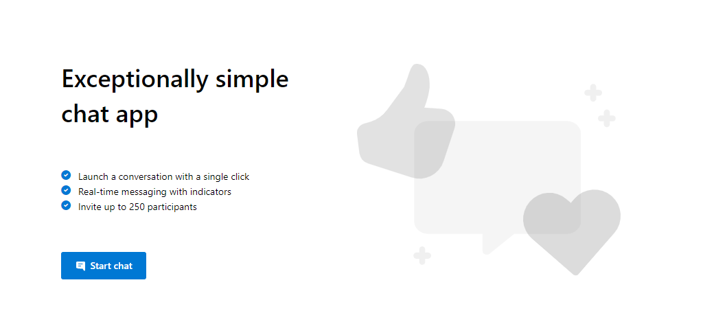

# Group Chat Sample

## Overview

This is a sample application to show how we can use the `@azure/communication-react` package to build a chat experience.
Learn more about the [Azure Communication Services UI Library](https://azure.github.io/communication-ui-library/). 
The client-side application is a React based user interface. Alongside this front-end is a NodeJS web application powered by ExpressJS that performs functionality like minting new user tokens for each chat participant.

Additional documentation for this sample can be found on [Microsoft Docs](https://docs.microsoft.com/en-us/azure/communication-services/samples/chat-hero-sample).

## ❤️ Feedback

We appreciate your feedback and energy helping us improve our services. [If you've tried the service, please give us feedback through this survey](https://microsoft.qualtrics.com/jfe/form/SV_9WTOR2ItSo0oFee). 

## Prerequisites

- [Visual Studio Code (Stable Build)](https://code.visualstudio.com/download)
- [Node.js (LTS version)](https://nodejs.org/)
- Create an Azure account with an active subscription. For details, see [Create an account for free](https://azure.microsoft.com/free/?WT.mc_id=A261C142F).
- Create an Azure Communication Services resource. For details, see [Create an Azure Communication Resource](https://docs.microsoft.com/azure/communication-services/quickstarts/create-communication-resource). You'll need to record your resource **connection string** for this quickstart.
## Code structure

- ./Chat/src/app: Where the client code lives
- ./Chat/src/app/App.tsx: Entry point into the chat sample 
- ./Chat/src/app/HomeScreen.tsx: The first screen in the chat sample
- ./Chat/src/app/ConfigurationScreen.tsx: Where to set your name and avatar for the chat
- ./Chat/src/app/ChatScreen.tsx: The main chat thread screen
- ./Chat/src/app/EndScreen.tsx: The screen the user will see when they are no longer in the chat thread
- ./Chat/src/app/ErrorScreen.tsx: The screen when an error occurs in the chat thread
- ./Server: server code
- ./Server/appsettings.json: Where to put your azure communication services connection string

## Before running the sample for the first time

1. Open an instance of PowerShell, Windows Terminal, Command Prompt or equivalent and navigate to the directory that you'd like to clone the sample to.
2. `git clone https://github.com/Azure-Samples/communication-services-web-chat-hero.git`
3. Get the `Connection String` from the Azure portal. For more information on connection strings, see [Create an Azure Communication Resources](https://docs.microsoft.com/en-us/azure/communication-services/quickstarts/create-communication-resource)
4. Once you get the `Connection String`, Add the connection string to the **Server/appsettings.json** file found under the Chat folder. Input your connection string in the variable: `ResourceConnectionString`.
5. Once you get the `Endpoint`, add the endpoint string to the **Server/appsetting.json** file. Input your endpoint in the variable: `EndpointUrl`.
6. Get the `identity` from the Azure portal. Click on `Identities & User Access Tokens` in Azure portal. Generate a user with `Chat` scope.
7. Once you get the `identity` string, add the identity string to the **Server/appsetting.json** file. Input your identity string in the variable: `AdminUserId`. This is the server user to add new users to the chat thread.

## Local run

1. Set your connection string in `Server/appsettings.json`
2. Set your endpoint URL string in `Server/appsettings.json`
3. Set your adminUserId string in `Server/appsettings.json`
3. `npm run setup` from the root directory
4. `npm run start` from the root directory

## Publish to Azure

1. `npm run setup`
2. `npm run build`
3. `npm run package`
4. Use the [Azure extension](https://code.visualstudio.com/docs/azure/extensions) and deploy the `Chat/dist` directory to your app service

## Additional Reading

- [Azure Communication Services - UI Library](https://azure.github.io/communication-ui-library/) - To learn more about what the `@azure/communication-react` package offers.
- [Azure Communication Chat SDK](https://docs.microsoft.com/en-us/azure/communication-services/concepts/chat/sdk-features) - To learn more about the chat web sdk
- [FluentUI](https://developer.microsoft.com/en-us/fluentui#/) - Microsoft powered UI library
- [React](https://reactjs.org/) - Library for building user interfaces
